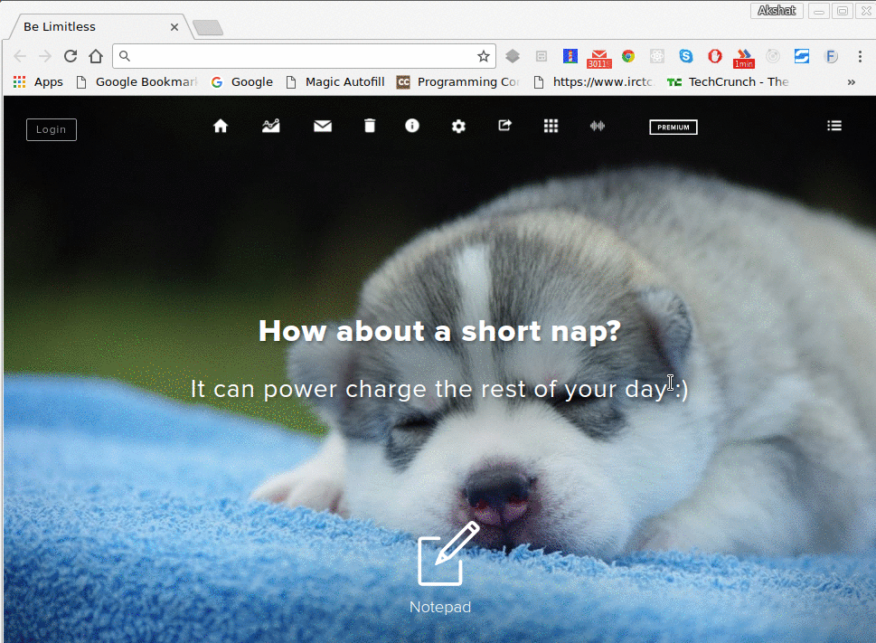

# Fearch

An extension for both Chrome and Firefox that lets you search music, videos, ebooks and other content available on FTP servers. It uses simple google search under the hood with the query modified to look only for FTP servers. We are interested in the content that is freely available on these servers.

## Working GIF

## Setup (Chrome)

1. Download or git pull the repo (Unzip if downloaded)
2. Open Google Chrome and click on the **Customize and control Google Chrome button** (ie the three dot button to the top-left of the application)
3. Go to **More tools** > **Extensions**
4. Click on the **developer mode** checkbox (present in top-right of the page)
5. Click on the **Load unpacked extension...** button.
6. Browse to the place where you have unziped or pulled the repo in step 1.
7. Extension is added to your browser. Enjoy !!
8. Launch the extension by clicking the extension's logo or by hitting `Ctrl+Shift+F` from your keyboard.

## Setup (Firefox)

1. Download or git pull the repo (Unzip if downloaded)
2. Open Firefox, open **about:debugging** in the url
3. Click **Load Temporary Add-on** and select any file in your **addon's directory**
4. Extension is added to your browser. Enjoy !!
5. Launch the extension by clicking the extension's logo or by hitting `Ctrl+Shift+F` from your keyboard.

## Screenshots
1. Add-on pop-up

2. FTP index page

3. Results page

## Issues

You can post bugs found in the extension here: https://github.com/NIT-dgp/chrome-search-extension/issues

## Get Involved

We would love to have you work with us. Check out the development wiki page for more in-depth details about contributing code and fixing bugs. You can find us on the NIT-dgp [#general](https://gitter.im/NIT-dgp/General) gitter channel.
